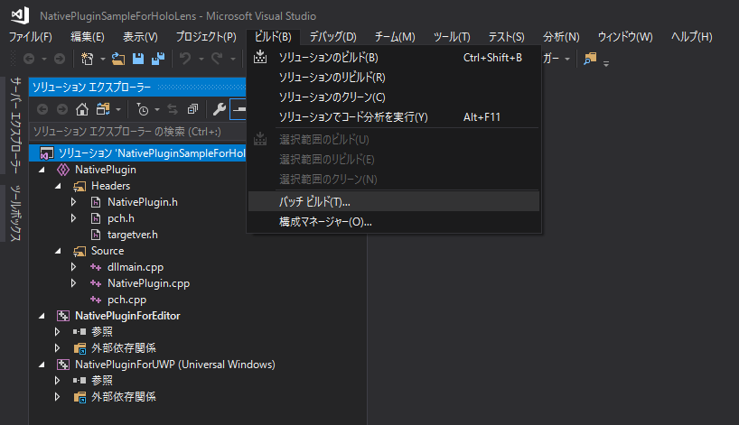
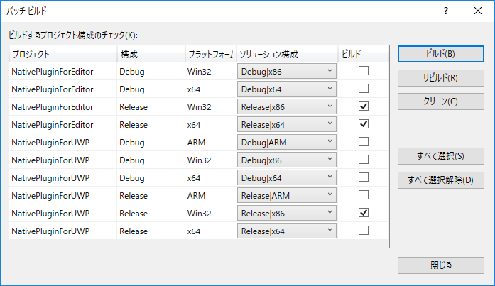
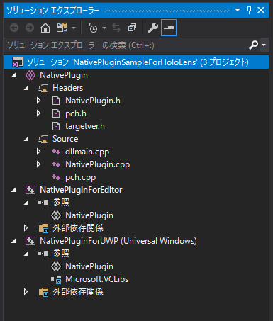

# Depth Stream Compression Native Plugin

## License
- RVL.cpp is licensed under the MIT License.  
  Copyright (c) 2017 Andrew D. Wilson  
  Copyright (c) 2020 Soichiro Sugimoto  

- TemporalRVL.cpp is licensed under the MIT License.  
  Copyright (c) 2020 Hanseul Jun  
  Copyright (c) 2020 Soichiro Sugimoto  

- このプロジェクトは、上記のアセットを除き、MIT Licenseでライセンスされています。  
  This project is licensed under the MIT License excluding the assets listed above.

## Tested Environment
- Visual Studio 2019 (Version 16.6.0)
- Windows 10

## How to build
1. Visual Studio 2019で「DepthStreamCompression.sln」を開く。  
   Open "DepthStreamCompression.sln" in Visual Studio 2019.

2. ビルド -> バッチビルド を選択。  
   Select Build -> Batch build.

3. ビルドするプロジェクトを選択してビルドを実行する。HoloLens(UWP)用DLLとWindows用DLL(32bit/64bit)を選択する。

4. ビルドが成功すると3つのDLLが生成される
- Windows(32bit)用DLL -> DepthStreamCompressionPlugin\Release\NativePluginForEditor\DepthStreamCompression.dll
- Windows(64bit)用DLL -> DepthStreamCompressionPlugin\x64\Release\NativePluginForEditor\DepthStreamCompression.dll
- HoloLens(UWP)用DLL -> DepthStreamCompressionPlugin\Release\NativePluginForUWP\DepthStreamCompression.dll

## 解説
ソリューション構成は、Windows用DLLのプロジェクトとHoloLens(UWP)用DLLのプロジェクトをまとめた形になっている。

ソリューション構成は以下の通り。
- NativePlugin -> ソースコード管理用の共有プロジェクト
- NativePluginForEditor -> Windows環境の実行時に利用されるDLL用のプロジェクト
- NativePluginForUWP -> HoloLens実機の実行時に利用されるDLL用のプロジェクト

